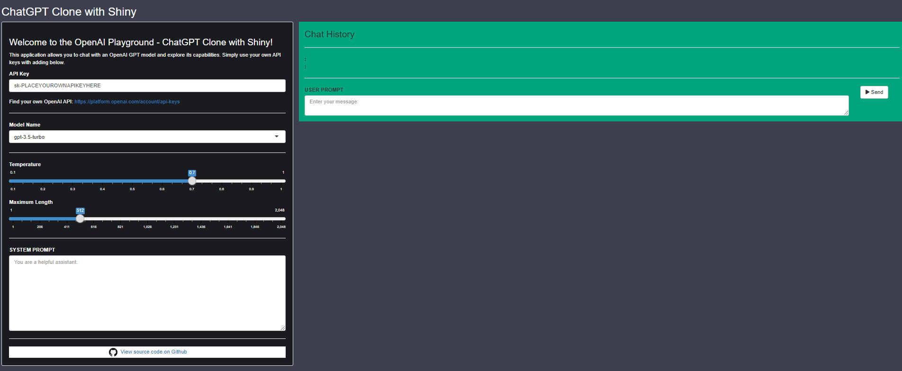

# ShinyChatGPT - OpenAI ChatGPT Clone with Shiny

### A user-friendly AI playground for interacting with OpenAI’s GPT models, built using the R programming language and Shiny framework.

The **ShinyChatGPT** application allows users to chat with an AI assistant in real-time. Whether you're exploring AI capabilities, testing various models, or simply curious about AI interactions, this app provides a seamless chat-like interface for accessing GPT responses. Customizable model and response settings offer a personalized AI experience.

---

## 🌟 Key Features

### 🔑 Secure API Key Input
**Securely enter your OpenAI API key** to connect the application directly to OpenAI. This unlocks the full capabilities of your selected GPT model.

### 🧠 Flexible Model Selection
**Choose from a variety of GPT models**, including GPT-4, GPT-4-0314, GPT-3.5-Turbo-0301, and GPT-3.5-Turbo. This allows you to balance cutting-edge performance with response style, tailoring the AI to your specific needs.

### 🎛 Customizable AI Behavior
Fine-tune your interaction with these adjustable settings:
*   **Temperature Control:** Adjust the randomness of responses; higher values (e.g., 0.8) create more diverse outputs, while lower values (e.g., 0.2) produce more focused and deterministic text.
*   **Max Length Adjustment:** Customize the maximum length of AI responses to encourage brevity or allow for more detailed explanations.
*   **Custom System Prompt:** Define the AI's persona, tone, and behavioral guidelines by providing a custom system message for a more guided and tailored conversation.

### 💬 Interactive Chat Experience
Engage with the AI through a user-friendly, real-time chat interface that clearly displays your conversation history. Key chat functionalities include:
*   **Clear Chat History:** Instantly reset your current conversation and start fresh.
*   **Download Chat History:** Easily save your complete chat log as a text file for future reference or analysis.

---

## 📦 Dependencies

This project relies on the following R packages:
- shiny
- httr
- stringr
- shinyjs
- jsonlite

---

## 🚀 Try It Out on shinyapps.io
Experience ShinyChatGPT live on Shinyapps.io!

👉 [Launch the App on shinyapps.io](https://tolgakurtuluss.shinyapps.io/shinychatgpt/)

---

## 🚀 Running Locally

Follow these steps to run ShinyChatGPT on your local machine:

### 1. Prerequisites
- **R:** Ensure you have R installed. You can download it from [the R project website](https://www.r-project.org/).
- **RStudio IDE (Recommended):** While not strictly necessary, RStudio provides a user-friendly environment for R development. Download it from [the RStudio website](https://posit.co/download/rstudio-desktop/).

### 2. Clone the Repository
Open your terminal or command prompt and run the following commands:
```bash
git clone https://github.com/tolgakurtuluss/shinychatgpt.git
cd shinychatgpt
```

### 3. Install Dependencies
You need to install the R packages listed in the "Dependencies" section. Open R or RStudio and run the following command in the R console:
```R
install.packages(c("shiny", "httr", "stringr", "shinyjs", "jsonlite"))
```

### 4. Run the App
There are a couple of ways to run the app:
- **Using RStudio:**
    1. Open the `shinychatgpt.R` file in RStudio.
    2. Click the "Run App" button that appears at the top of the script editor.
- **Using the R Console:**
    1. Navigate to the project directory (`shinychatgpt`) in your R console.
    2. Run the command: `shiny::runApp()`

Once the app is running, it should open in your default web browser.

---

## 🔧 How to Use

1. **Enter API Key**: Paste your OpenAI API key into the designated field. Don’t have one? [Get an API key here](https://platform.openai.com/account/api-keys).
2. **Select Model**: Choose a model that suits your needs. The default model is `gpt-3.5-turbo`.
3. **Set Parameters**: Adjust settings like temperature, max response length, and system prompt to customize the AI's responses.
4. **Start Chatting**: Type your messages, click "Send," and enjoy the conversation!

---

## 🌐 Interface Overview



The clean and intuitive UI is designed to make interactions seamless and visually appealing.

---

## 📝 Additional Information

- **License**: MIT
- **Author**: Tolga Kurtulus
- **Source Code**: [GitHub Repository](https://github.com/tolgakurtuluss/shinychatgpt)

---

## 🙌 Contributing to ShinyChatGPT

We welcome contributions to ShinyChatGPT! Whether you're fixing a bug, proposing a new feature, or improving documentation, your help is appreciated. Please take a moment to review these guidelines to make the contribution process as smooth as possible.

### 🐛 Reporting Bugs
If you encounter a bug, please help us by reporting it. Before submitting a new bug report, please check the existing [issues on GitHub](https://github.com/tolgakurtuluss/shinychatgpt/issues) to see if the bug has already been reported.

When reporting a bug, please include:
- A clear and descriptive title.
- A detailed description of the bug and the steps to reproduce it.
- What you expected to happen and what actually happened.
- Information about your environment, such as your R version, operating system, and browser, if relevant.

You can report bugs by [opening a new issue](https://github.com/tolgakurtuluss/shinychatgpt/issues/new?assignees=&labels=bug&template=bug_report.md&title=) on our GitHub repository.

### ✨ Suggesting Enhancements
We're always looking for ways to improve ShinyChatGPT. If you have an idea for a new feature or an enhancement to an existing one:
- Check the [issues on GitHub](https://github.com/tolgakurtuluss/shinychatgpt/issues) to see if your idea has already been suggested.
- If your idea is new, consider [opening an issue](https://github.com/tolgakurtuluss/shinychatgpt/issues/new?assignees=&labels=enhancement&template=feature_request.md&title=) to discuss it. This allows us to provide feedback and align on the scope before you put significant effort into development.
- For minor enhancements, you can directly proceed to creating a pull request.

### Pull Request Process
If you'd like to contribute code to fix a bug or implement an enhancement, please follow these steps:

1.  **Fork the repository:** Click the "Fork" button at the top right of the [ShinyChatGPT GitHub page](https://github.com/tolgakurtuluss/shinychatgpt).
2.  **Clone your fork:**
    ```bash
    git clone https://github.com/YOUR_USERNAME/shinychatgpt.git
    cd shinychatgpt
    ```
3.  **Create a new branch:** Choose a descriptive branch name for your feature or bugfix.
    ```bash
    # For a new feature
    git checkout -b feature/YourAmazingFeature
    # For a bug fix
    git checkout -b fix/YourBugFix
    ```
4.  **Make your changes:** Write your code and make sure it's clean and well-commented where necessary.
5.  **Test your changes:** Ensure your changes work as expected and do not introduce new issues.
6.  **Commit your changes:** Use clear and descriptive commit messages.
    ```bash
    git add .
    git commit -m "feat: Implement AmazingFeature" 
    # or "fix: Resolve specific bug"
    ```
7.  **Push your branch to your fork:**
    ```bash
    git push origin feature/YourAmazingFeature
    ```
8.  **Open a Pull Request:** Go to the original [ShinyChatGPT repository](https://github.com/tolgakurtuluss/shinychatgpt) and click "New pull request". Compare your branch with the `main` branch of the original repository. Provide a clear title and description for your pull request, explaining the changes and their purpose.

We will review your pull request as soon as possible and provide feedback or merge it. Thank you for your contribution!

---

Let ShinyChatGPT be your entry into the world of conversational AI – designed to be intuitive, customizable, and powerful!
