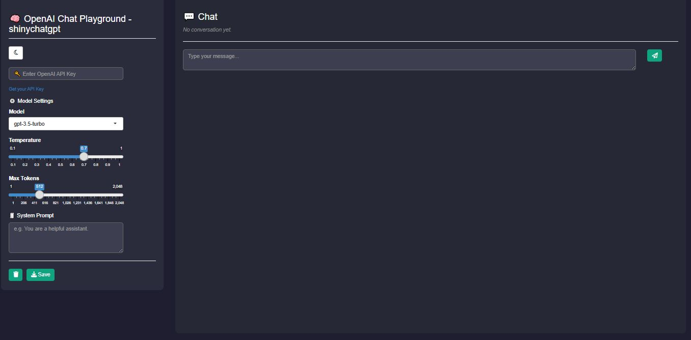
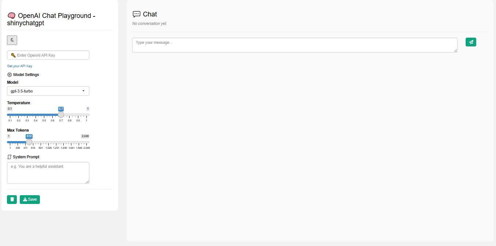
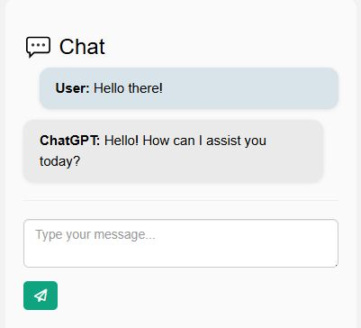

# ShinyChatGPT - OpenAI ChatGPT Clone with Shiny

A beautiful, themeable, and user-friendly R Shiny interface for interacting with OpenAI's Chat Completions API.  
Inspired by the official [OpenAI Playground](https://platform.openai.com/playground), this app supports:

- ✅ Chat with GPT models (gpt-3.5-turbo, gpt-4, gpt-4o, etc.)
- 🎨 Light/Dark theme toggle (with local storage memory)
- 🔄 Loading spinner while waiting for API
- 💬 Chat history with styled bubbles
- ⚙️ Adjustable temperature, max tokens, and system prompt
- 📤 Download chat history
- 🧼 Clear chat button
- 🧩 Responsive layout with custom styling

---

## 🌐 App Interface

The clean and intuitive UI is designed to make interactions seamless and visually appealing.

Dark Mode Example


White Mode Example


Chat Interface Example


---

## 📦 Requirements

- R ≥ 4.0
- Shiny
- shinyjs
- httr
- jsonlite

---

## 🚀 Try It Out on shinyapps.io
Experience ShinyChatGPT live on Shinyapps.io!

👉 [Launch the App on shinyapps.io](https://tolgakurtuluss.shinyapps.io/shinychatgpt/)

---

## 🚀 Running Locally

Follow these steps to run ShinyChatGPT on your local machine:

### 1. Prerequisites
- **R:** Ensure you have R installed. You can download it from [the R project website](https://www.r-project.org/).
- **RStudio IDE (Recommended):** While not strictly necessary, RStudio provides a user-friendly environment for R development. Download it from [the RStudio website](https://posit.co/download/rstudio-desktop/).

### 2. Clone the Repository
Open your terminal or command prompt and run the following commands:
```bash
git clone https://github.com/tolgakurtuluss/shinychatgpt.git
cd shinychatgpt
```

### 3. Install Dependencies
You need to install the R packages listed in the "Dependencies" section. Open R or RStudio and run the following command in the R console:
```R
install.packages(c("shiny", "shinyjs", "httr", "jsonlite"))
```

### 4. Run the App
There are a couple of ways to run the app:
- **Using RStudio:**
    1. Open the `shinychatgpt.R` file in RStudio.
    2. Click the "Run App" button that appears at the top of the script editor.
- **Using the R Console:**
    1. Navigate to the project directory (`shinychatgpt`) in your R console.
    2. Run the command: `shiny::runApp()`

Once the app is running, it should open in your default web browser.

